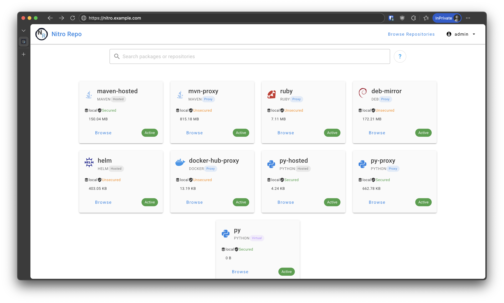

# pkgly [](https://docs.pkgly.dev/) [](https://github.com/actix/actix-web)

Pkgly is an open source free artifact manager. Written with a Rust back end and a Vue front end.

### UI Preview

<p align="center">
  
</p>

More UI screenshots:
- [Repository view](docs/images/repo-view.png)
- [Search view](docs/images/search-view.png)
- [Admin repository management](docs/images/admin-repo-mgmt.png)
- [Admin repository packages](docs/images/admin-repo-packages.png)
- [Admin user management](docs/images/admin-user-mgmt.png)

### Overview

After years of using Artifactory and then switching to Nexus it turned out that there're no good, feature rich open source artifacts repository managers. Please welcome Pkgly with S3 backend and SSO auth support.

At the moment it supports virtual, proxied and hosted repositories of:

- debian
- python
- php (composer)
- java maven
- ruby (gems)
- docker (oci, v2 and v1)
- helm (oci and http)
- go
- npm
- nuget (.NET / NuGet V3)
- rust cargo (hosted only)

### Technical Design

- Backend or the heart of pkgly
  - SQLX for Postgres
  - Axum for HTTP Server
- Frontend
  - Vue
  - Vite

### Crates
- crates/core
  - Lays out some shared data types between different modules.
- crates/macros
  - Macros used by the other crates. To prevent writing so much code
- crates/storages
  - This layer provides different ways storing the artifacts that pkgly hosts

### Development

#### Prerequisites
- Docker and Docker Compose
- Rust (latest stable)
- Node.js (for frontend development)

#### Quick Start
1. Clone the repository
2. Run `./dev.sh` to build and start the development environment
3. Access Pkgly at `http://localhost:8000`
4. Access the API documentation at `http://localhost:8000/api/docs`

#### Tracing & Observability

The development environment includes distributed tracing with Jaeger to help diagnose performance issues:

- **Jaeger UI**: Available at `http://localhost:16686`
- **Tracing Configuration**: Automatically enabled in development via `docker-compose.dev.yml`
- **Key Traced Operations**:
  - HTTP requests (method, route, status code, timing)
  - Docker Registry V2 operations (blob upload, chunk processing)
  - Database operations and configuration loading
  - Authentication and session management
  - Background tasks and cleanup operations

#### Environment Variables
The development compose file automatically configures tracing with:
- `OTEL_EXPORTER_OTLP_ENDPOINT=http://jaeger:4317`
- `OTEL_SERVICE_NAME=pkgly`
- `PKGLY_TRACING_ENABLED=true`

#### Logging

Logging is configured via TOML (not `RUST_LOG`). Global levels are set in `[log.levels]` (and `[log.levels.others]`), and each logger may optionally define its own `[...config.levels]`; per-logger levels inherit any missing targets from the global set.

Recommended “Docker-friendly” console config:

```toml
[log.loggers.console]
type = "Console"

[log.loggers.console.config]
format = "compact"
ansi_color = true
include_span_context = false
```

Exporting logs to OTLP (optional):

```toml
[opentelemetry]
enabled = true
traces = true
logs = true
```

#### Instrumentation Guidelines

- For Axum handlers, always `skip(...)` `State(site)`, `Authentication`, and request bodies (passwords/tokens/config JSON).
- Prefer explicit `fields(...)` with small identifiers (e.g., `repository_id`, `user`), and avoid `?` debug on large structs.
- Example:

```rust
#[instrument(skip(site, auth, request), fields(repository_id = %repository_id, user = %auth.id))]
```

#### Troubleshooting
- If Docker upload operations are blocking the async runtime, check Jaeger traces for long-running spans
- Use `docker-compose logs pkgly` to view application logs
- Restart services with `./dev.sh` after making configuration changes

### Credits
Originally developed as [nitro-repo](https://github.com/wyatt-herkamp/nitro_repo) fork.
